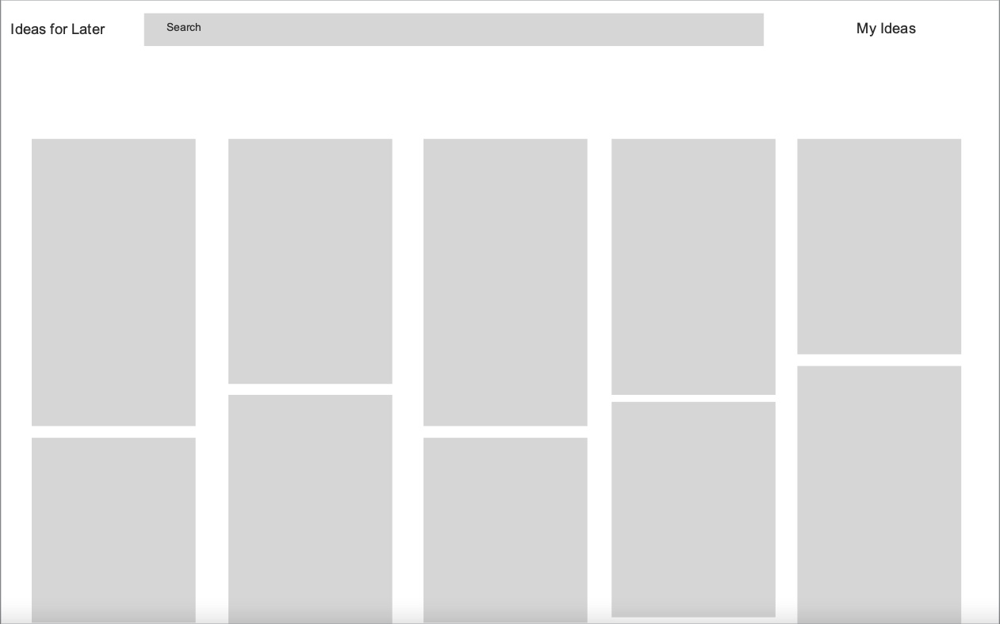
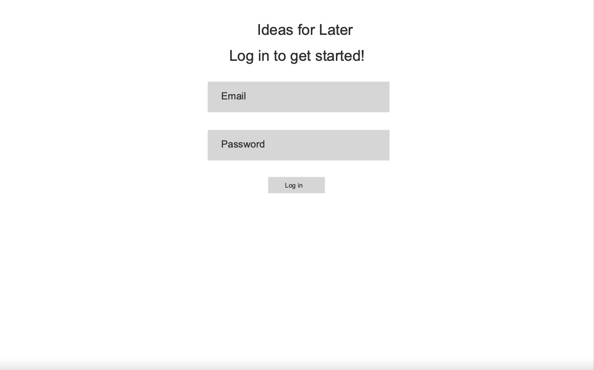
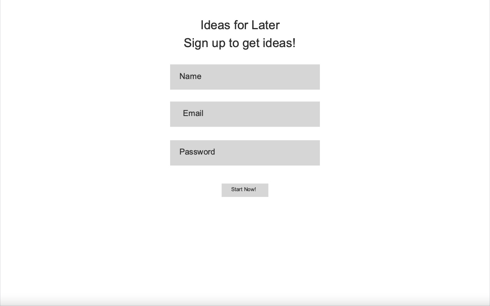
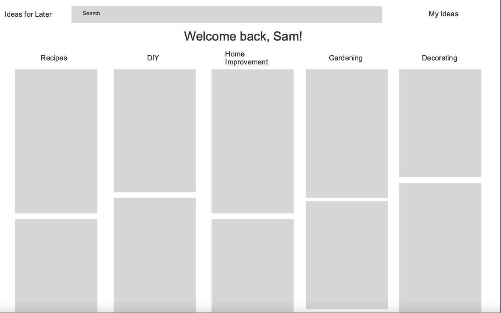
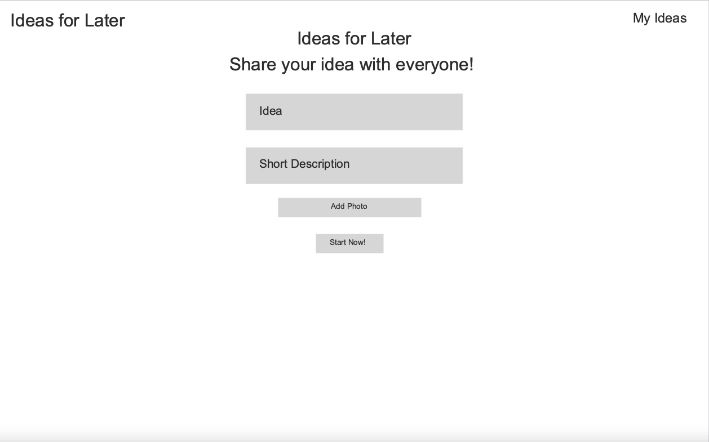
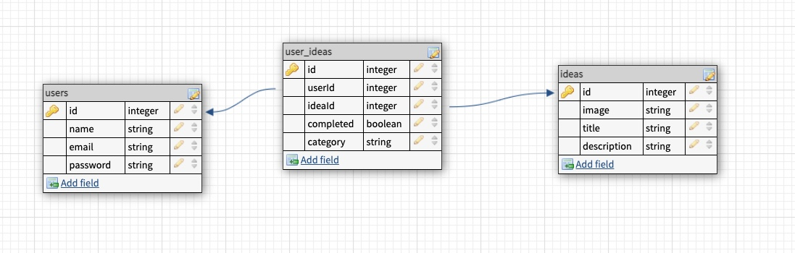
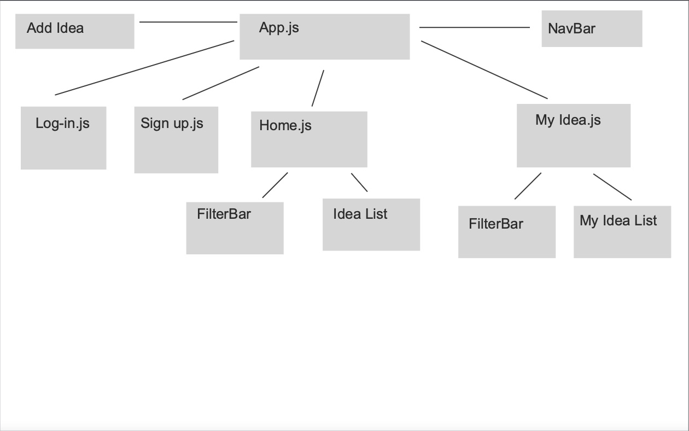

# Ideas for Later

## Summary:
Ideas for later will let users save picture ideas for projects, recipes, diy and much more! This way they can come back to them later and give them a try!

## User Stories:
* When page loads the user will see a gallery of photos, the public board.
* User can search public board for ideas
* If the user is logged out they won't be able to save an idea, the heart will stay outlined
* In logged out state the top navigation bar the user will see log-in, sign-up and home.
* When the user either log's in or sign's up they will then see on the top navigation bar logout, your ideas and home.
* When the user clicks on a outlined heart they will be able to save it to their idea board & heart will change to red.
* When the user clicks on My Ideas the will be directed to page with all their saved ideas.
* In the my ideas section they will see saved incomplete ideas and saved complete ideas.
* In the my ideas area the user can search through their photos to find the idea they are looking for.
* After the user completes or does an idea they can mark it as complete on their board.

## Wireframes:
#### Home - logged out

#### Home - logged in

#### Log-in form

#### Sign up form

#### My Idea page

#### Add Idea Form

## ERD

## Component Tree

## Routes:
### User Routes
VERB | PATH | SUMMARY
-----|------|--------
POST | / | create user
POST | /login | user can login
GET  | /verify | grab user from db

### Idea Routes
VERB | PATH | SUMMARY
-----|------|--------
GET  | /ideas | get all ideas
GET | /ideas/favorite | get faovrited ideas
GET | /ideas/favorite/complete | get users completed ideas
POST | /ideas/favorite| favorite an idea from public board
POST | /ideas/create | create a new idea
PUT  | /ideas/favorite/:ideaId | change fav idea to complete

## Technologies:
* React
* Express
* Sequelize
* Node.js
* CSS

## Completion Timeline:
#### Friday -
1. Frontend/backend set-up
1. Backend db and table set-up
1. Create seeder for idea db
1. Backend set-up for log-in, sign-up, and verify
1. Frontend set-up for log-in, sign-up, log-out, global state
#### Saturday-Sunday -
1. Hash password
1. Encrypt ID
1. GET all ideas on homepage
1. Save ideas My Ideas page
1. GET user saved ideas

#### Monday -
1. User can change ideas to complete
1. User can see completed ideas
1. User can create new idea
1. Allow user to upload photos

#### Tuesday - 
1. New idea populates on public board
1. Be able to search public board for ideas
1. Set up category table(stretch goal)

#### Wednesday
1. Deployment of frontend/backend
1. User can save idea to certain category(stretch goal)
1. Ideas will populate in specific area(stretch)

#### Thursday (buffer day in case debugging causes things to get pushed back or stretch)
1. Styling
1. Anything that gets pushed back due to debugging

#### Friday
1. Any last minute issues depending on when presentation start

## Challenges
* Allowing user to upload photos
* Crypting id was a bit of a struggle in last solo

## MVP's:
1. User can log-in
1. User can logout
1. User can sign-up
1. Password hashing
1. UserId encryption
1. User can see all photo ideas when screen loads
1. When logged in user can save photos to board
1. Logged in user can also go to saved idea board
1. Idea board will show all incomplete and completed ideas
1. In idea board user can mark ideas as completed
1. Also, while logged in user can add new idea to public board
1. The new idea will show up at the top the public board
1. User can search public idea board/ my idea board for ideas

## Stretch Goals:
1. User can seperate ideas into different sections(predetermined sections)
1. Ideas have links to sights they are from

## Repo Link
https://github.com/sblum55/ideas-for-later-front
